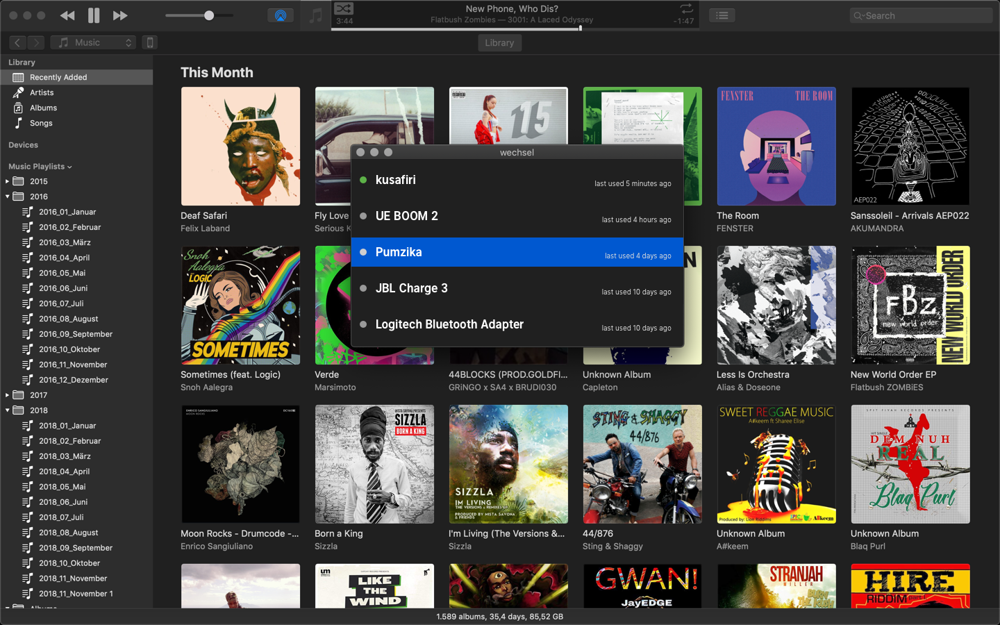

#  wechsel
*seamless switching between bluetooth devices*




In Development
### Development
```sh
git clone git@github.com:friedrichweise/wechsel.git
carthage update --platform macos
open wechsel.xcodeproj
```

### Dependencies
* <a href="https://github.com/toy/blueutil">blueutil</a> v2.2.0
* <a href="https://github.com/shpakovski/MASShortcut">MASShortcut</a> v2.3.6
* <a href="https://github.com/zemirco/swift-timeago">swift-timeago</a>
