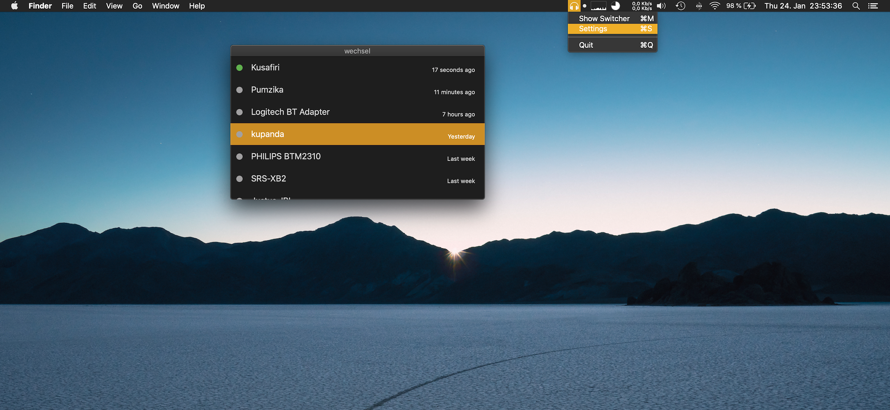

#  <a href="https://wechsel.weise.io/">wechsel</a>

wechsel (`/ˈvɛksəl/`) claims to simplify the interaction with  bluetooth connections on macOS. Instead of using the builtin Bluetooth menu bar, you can seamlessly switch between bluetooth audio devices using your keyboard. The tool offers a global hotkey to display a Spotlight-like window. It seeks to be a more generic alternative for similar tools like <a href="https://c-command.com/toothfairy/">ToothFairy</a> and <a href="https://www.producthunt.com/posts/airbuddy-2">AirBuddy</a>.
The implementation is based on the work of  <a href="https://github.com/toy/blueutil">blueutil</a> and utilizes the system level <a href="https://developer.apple.com/documentation/iobluetooth">IOBluetooth</a> framework.



### Installation

Install using homebrew:
```sh
brew tap friedrichweise/wechsel
brew cask install wechsel
```
or download the application from the <a href="https://github.com/friedrichweise/wechsel/releases">release-page</a>.

### Development Setup
```sh
git clone git@github.com:friedrichweise/wechsel.git
carthage update --platform macos
open wechsel.xcodeproj
```

### Dependencies
* <a href="https://github.com/shpakovski/MASShortcut">MASShortcut</a> v2.3.6
* <a href="https://github.com/sindresorhus/LaunchAtLogin">LaunchAtLogin</a> v2.5.0
* <a href="https://github.com/zemirco/swift-timeago">swift-timeago</a>
